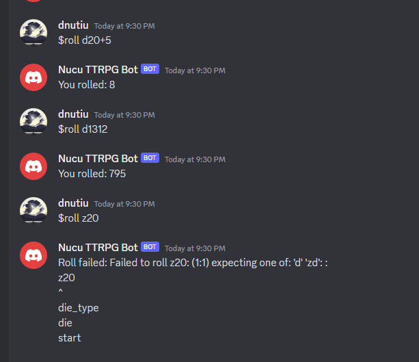

# Nucu's TTRPG Bot

⚠️ _Currently under development_

Nucu's table top role-playing game bot is a generic BOT 🤖 that aids your games.

It features:
- ✅ A custom dice roller and parser. 🎲 
- ❌ Artificial Intelligence.
- ❌ Cooking, brewing and farming skills.
- ❌ A discord interface, yeap we're working on that.
- ❌ Telemetry (We don't do that here)
- ❌ Paid Content.

### Screenshots



Made with 💞 by [nuculabs.dev](https://blog.nuculabs.dev)


# Running the bot

I've designed the bot to be run by yourself, and be configured via a configuration file.

You can view the configuration file example in the project's root under the name [config.yaml](config.yaml). 
The configuration file's location is the current directory and can be configured to something else with the 
following environment variable:

Example:

```shell
export NUCUBOT_CONFIG=/PycharmProjects/NucusTTRPGBot/secrets/config.yaml
python -m src.main
```
