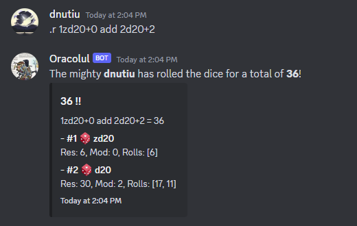

# Nucu's RPG Tools

⚠️ _Currently under development_

Nucu's table top role-playing game bot is a generic BOT 🤖 that aids your games.

It features:

- ✅ A custom dice roller and parser. 🎲
- ❌ Artificial Intelligence.
- ❌ Cooking, brewing and farming skills.
- ✅ A discord interface ➕➕➕
- ❌ Telemetry (We don't do that here)
- ❌ Paid Content.

### Screenshots



# Running the bot

I've designed the bot to be run by yourself, and be configured via a configuration file.
pyenv
You can view the configuration file example in the project's root under the name [config.yaml](config.yaml).
The configuration file's location is the current directory and can be configured to something else with the
following environment variable:

Example:

```shell
export NUCUBOT_CONFIG=/PycharmProjects/NucusTTRPGBot/secrets/config.yaml
python -m src.main
```

# Running the bot on Raspberry PI

To run this bot on your Raspberry PI device you will need to:

1. Clone this repo:

```shell
git clone https://github.com/dnutiu/Nucu-RPG-Bot.git
```

2. Install Python 3.11+. I use [pyenv](https://github.com/pyenv/pyenv/wiki).
3. Create a Discord [application](https://discord.com/developers/applications) and grab the bot token.

I use the following permissions:


4. Add your bot's token to the [config.yaml](config.yaml).
5. Install bot dependencies with `pip install -r requirements.txt`
6. Run `python -m src.main`
7. Invite the bot to your Discord server.

Made with 💞 by [nuculabs.dev](https://blog.nuculabs.dev)